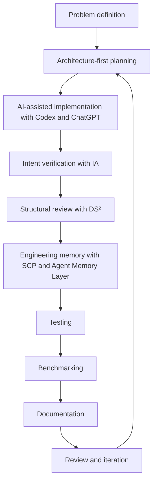

# AI-Native Engineering Workflow

I do not present AI tool use as a shortcut. I use AI as part of a structured engineering workflow.

The core idea is simple: AI accelerates implementation, while human engineering judgment controls architecture, verification, acceptance, and release.

Mermaid source: [assets/workflow.mmd](assets/workflow.mmd)

## 1. Problem Definition

The workflow starts by defining the engineering problem, constraints, non-goals, and expected evidence. This step keeps implementation from beginning before the desired behavior is clear.

## 2. Architecture-First Planning

Before implementation, the intended structure and system boundaries are identified. This includes deciding what should change, what should remain stable, and what evidence will show that the change is acceptable.

## 3. AI-Assisted Implementation Using Codex / ChatGPT

OpenAI Codex and ChatGPT are used as implementation accelerators. They help draft changes, explore alternatives, generate tests, summarize context, and speed up mechanical work.

They do not replace engineering judgment. Architecture, constraints, acceptance criteria, and release decisions remain human-directed.

## 4. Intent Verification Using IA

IA is used to compare implementation against engineering intent. The goal is to detect drift, missed constraints, architectural mismatch, and unsupported changes before they are treated as complete.

## 5. Structural Review Using DS²

DS² is used to review dependency relationships, structural risk, inherited execution authority, and capability surfaces. This helps catch risks that may not appear in a line-by-line code review.

## 6. Engineering Memory Through SCP / Agent Memory Layer

SCP and Agent Memory Layer preserve important context from adoption forward. This includes decisions, constraints, project intent, and workflow knowledge that future humans or AI sessions should not have to rediscover.

## 7. Testing

Tests provide executable evidence that behavior matches expectations. Test scope depends on the system and change, but the workflow treats tests as part of the review process rather than a final formality.

## 8. Benchmarking

Benchmarks are used where appropriate to evaluate repeatable concerns such as intent preservation, constraint compliance, architectural consistency, verification quality, and regression prevention.

## 9. Documentation

Documentation is treated as engineering work. It explains what the system does, how to review it, what evidence exists, and what limitations apply.

## 10. Review and Iteration

The workflow ends with review, correction, and iteration. AI-assisted output is not accepted because it is fluent or fast. It is accepted only when the implementation, evidence, and documentation support the intended engineering outcome.

## Why This Matters

The ecosystem exists to make AI-assisted development more reliable and reviewable. It does this by preserving context, verifying intent, exposing structure, learning from failures, and documenting limitations.
