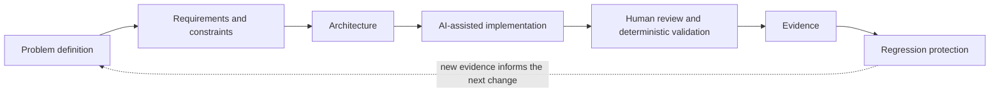

# Human-Directed, AI-Assisted Engineering Workflow

AI tools accelerate implementation; human judgment controls requirements, architecture, constraints, review, verification, acceptance, and final responsibility.

Mermaid source: [assets/workflow.mmd](assets/workflow.mmd).

## 1. Define the Problem

State expected behavior, non-goals, risks, and the evidence required for acceptance.

## 2. Record Requirements, Constraints, and Invariants

Make important boundaries inspectable before implementation. Intent Audit can encode a deliberately small set of repository constraints; SCP can preserve adoption-forward decisions where useful. Tool use is selected per task, not assumed as a runtime chain.

## 3. Design the Change

Identify system boundaries, responsibilities, data flow, failure modes, and compatibility concerns before implementation where the risk justifies it.

## 4. Implement with AI Assistance

Codex and ChatGPT may help draft changes, explore alternatives, generate tests, and perform mechanical work. Generated output is treated as untrusted until reviewed.

## 5. Review and Verify

Inspect the diff, run relevant tests and static checks, compare behavior with explicit intent, and examine failure paths. RepoLens, DS2, Intent Audit, or other tools may provide evidence where applicable; this is not a claim that every project integrates them.

## 6. Preserve Evidence

Keep useful tests, receipts, reports, citations, example outputs, and documentation. Clearly distinguish executed results from plans or hypotheses.

## 7. Add Regression Protection

Protect corrected behavior with deterministic tests or checks where practical. Record remaining assumptions and limitations.

## Acceptance Standard

Fluency and speed are not acceptance criteria. Work is accepted only when implementation and evidence support the intended behavior and a human reviewer takes responsibility for the result.

See [ENGINEERING_PRINCIPLES.md](ENGINEERING_PRINCIPLES.md).
