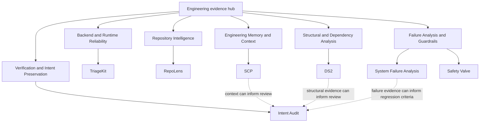

# Capability and Evidence Map

This hub maps engineering capabilities to independent public repositories. The diagram is a review and reasoning model, not a deployed topology or claim that all repositories form one runtime.

Mermaid source: [assets/architecture.mmd](assets/architecture.mmd).

## Backend and Runtime Reliability

[TriageKit](https://github.com/ragnarok268/TriageKit) is an independent FastAPI service. It implements authentication, persistence, migration, provider boundaries, reliability metadata, logging, request IDs, bounded transient-failure retries, health endpoints, Docker Compose, CI, and tests.

## Verification and Intent Preservation

[Intent Audit](https://github.com/ragnarok268/IA) (repository `IA`) is a local CLI that checks a deliberately small machine-readable intent contract and writes deterministic receipts. Canary is its diagnostic path for failed verification, with evidence, classification, bounded hypotheses, repair recommendations, and regression guidance.

## Repository Intelligence

[RepoLens](https://github.com/ragnarok268/RepoLens) performs local repository scanning, deterministic chunking, vector persistence, citation-grounded retrieval, and architecture summarization. It is not presented as a TriageKit runtime dependency.

## Structural and Dependency Analysis

[DS2](https://github.com/ragnarok268/DS2) maps declared dependencies, observed imports, exposure classes, and inherited authority into reports, graphs, and receipts. Static output does not prove runtime reachability.

## Engineering Memory and Context

[SCP](https://github.com/ragnarok268/scp) preserves adoption-forward decisions in validated YAML records and provides repository identity and boundary preflight checks.

## Failure Analysis and Guardrails

[System Failure Analysis](https://github.com/ragnarok268/system-failure-analysis) contains evidence-bounded engineering case studies. [Safety Valve](https://github.com/ragnarok268/safety-valve) is a separate local reference artifact for deterministic pre-inference policy routing.

## Relationship Boundaries

Dashed arrows mean that an artifact *can inform* a review. They do not claim an implemented API call, shared deployment, automated orchestration, or production integration. TriageKit and RepoLens are intentionally shown without invented cross-project edges.

Additional supporting repositories remain listed in [PROJECT_MAP.md](PROJECT_MAP.md), but the architecture prioritizes the strongest verified evidence.
