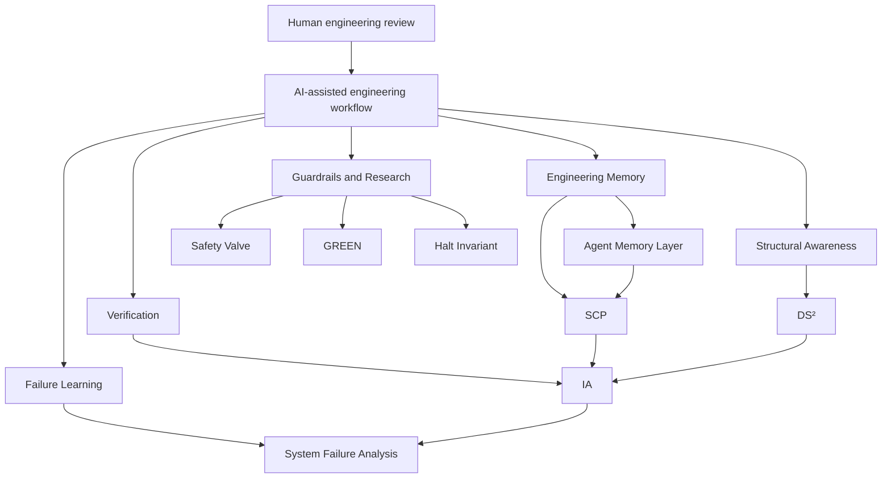

# Architecture

The ecosystem is organized as a layered set of engineering systems for making AI-assisted software development more reliable and reviewable.

The layers are not a single monolithic product. They are related open-source systems that address different failure modes in AI-assisted engineering.

Mermaid source: [assets/architecture.mmd](assets/architecture.mmd)

## Layer 1: Engineering Memory

Engineering memory addresses context loss, repeated explanation, and poor handoff between development sessions.

### Agent Memory Layer

[Agent Memory Layer](https://github.com/ragnarok268/agent-memory-layer) provides repository-local engineering memory for AI-assisted software development. It preserves engineering intent, architectural decisions, project knowledge, and structured workflows across development sessions.

Inputs:

- repository context
- project instructions
- engineering decisions
- workflow records
- session handoff material

Outputs:

- reusable project memory
- structured context for future AI-assisted work
- preserved engineering intent
- reduced repeated explanation across sessions

### SCP

[SCP](https://github.com/ragnarok268/scp) is a persistent engineering knowledge and decision-preservation model. It captures project origins, milestones, rationale, constraints, and significant engineering decisions so context survives across sessions and contributors.

Inputs:

- project origins
- significant decisions
- constraints
- rationale
- evidence and future traps

Outputs:

- durable semantic cards
- decision records
- milestone records
- reviewable reasoning history from adoption forward

## Layer 2: Verification

Verification addresses intent drift, weak acceptance criteria, and difficulty reviewing AI-generated changes.

### IA

[IA](https://github.com/ragnarok268/IA) is a deterministic verification system for checking AI-generated changes against engineering intent. It supports intent validation, architectural drift detection, constraint verification, and engineering receipts.

Inputs:

- stated engineering intent
- implementation changes
- constraints
- acceptance criteria
- architectural expectations

Outputs:

- verification results
- drift findings
- constraint checks
- engineering receipts
- review evidence

## Layer 3: Structural Awareness

Structural awareness addresses dependency blind spots, inherited execution authority, and unclear capability surfaces.

### DS²

[DS2](https://github.com/ragnarok268/DS2) is a dependency surface and structural analysis system. It maps dependency relationships, inherited execution authority, structural risk, and capability surfaces to improve architectural awareness and engineering governance.

Inputs:

- repository files
- dependency manifests
- import relationships
- framework and runtime structure

Outputs:

- dependency graphs
- structural risk summaries
- authority surface analysis
- reviewable reports and receipts

## Layer 4: Failure Learning

Failure learning addresses repeated mistakes, weak debugging memory, and regression risk.

### System Failure Analysis

[System Failure Analysis](https://github.com/ragnarok268/system-failure-analysis) is a framework for deterministic root-cause analysis, Failure Fingerprints, regression prevention, and evidence-driven debugging.

Inputs:

- observed failures
- logs or traces where available
- reproduction steps
- system behavior
- expected behavior

Outputs:

- likely root-cause analysis
- Failure Fingerprints
- prevention notes
- regression-oriented evidence

## Layer 5: Guardrails and Research

Guardrails and research address bounded execution, reliable stopping behavior, and reliability-oriented AI workflow design.

### Safety Valve

[Safety Valve](https://github.com/ragnarok268/safety-valve) is a deterministic guardrail concept for AI-assisted engineering workflows.

### GREEN

[GREEN](https://github.com/ragnarok268/GREEN-public) is a supporting engineering framework for reliable AI workflow development.

### Halt Invariant

[Halt Invariant](https://github.com/ragnarok268/halt-invariant) covers research and engineering work related to deterministic stopping conditions and reliable AI behavior.

## System Relationship

The systems are designed to support a workflow in which AI accelerates implementation, while human-directed architecture, verification, documentation, testing, and review remain central.

Agent Memory Layer and SCP preserve context and decisions. IA verifies changes against intent. DS² improves awareness of structural and dependency risk. System Failure Analysis turns failures into reusable evidence. Safety Valve, GREEN, and Halt Invariant explore guardrails and reliability constraints.
