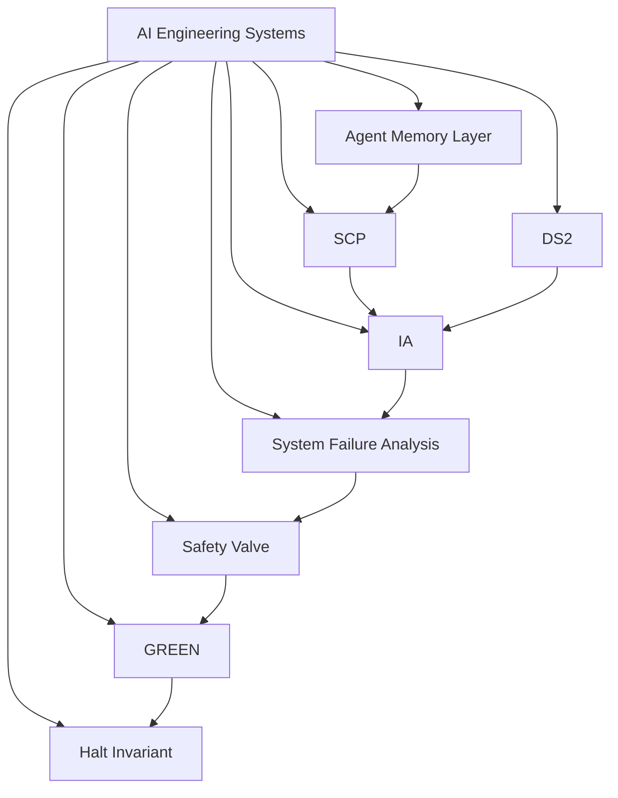

# AI Engineering Systems

Documentation and architecture for an integrated ecosystem of AI-assisted software engineering systems.

## Mission

This repository is the documentation and navigation hub for an ecosystem of open-source systems focused on reliable AI-assisted software engineering.

It exists to make the full ecosystem understandable from one place: what each system does, why it exists, how the systems connect, what evidence is available, and what limitations should be kept in view during review.

## Why This Exists

AI-assisted development increases speed, but it also introduces risks:

- context loss
- intent drift
- architectural inconsistency
- dependency blind spots
- weak verification
- repeated mistakes
- poor handoff between sessions and tools

These systems explore ways to make AI-assisted development more reliable, verifiable, maintainable, and architecturally consistent.

## Start Here

**5-minute review**

- Read this README.
- Review the architecture diagram.
- Open [Agent Memory Layer](https://github.com/ragnarok268/agent-memory-layer).

**15-minute review**

- Read [START_HERE.md](START_HERE.md).
- Review Agent Memory Layer, SCP, IA, and DS².
- Review the benchmark summary in [BENCHMARKS.md](BENCHMARKS.md).

**30+ minute technical review**

- Read [ARCHITECTURE.md](ARCHITECTURE.md).
- Read [AI_NATIVE_WORKFLOW.md](AI_NATIVE_WORKFLOW.md).
- Review [BENCHMARKS.md](BENCHMARKS.md).
- Open the core repositories.

## Core Systems

| System | Purpose | Repository | Primary engineering concern |
| --- | --- | --- | --- |
| Agent Memory Layer | Repository-local engineering memory for AI-assisted software development. | [agent-memory-layer](https://github.com/ragnarok268/agent-memory-layer) | Preserving context, intent, workflows, and project knowledge across sessions. |
| SCP | Persistent engineering knowledge and decision-preservation model. | [scp](https://github.com/ragnarok268/scp) | Capturing origins, milestones, rationale, constraints, and significant engineering decisions. |
| IA | Deterministic verification system for checking AI-generated changes against engineering intent. | [IA](https://github.com/ragnarok268/IA) | Intent validation, architectural drift detection, constraint verification, and engineering receipts. |
| DS² | Dependency surface and structural analysis system. | [DS2](https://github.com/ragnarok268/DS2) | Mapping dependency relationships, inherited execution authority, structural risk, and capability surfaces. |

## Supporting Systems

| System | Purpose | Repository | Role in ecosystem |
| --- | --- | --- | --- |
| System Failure Analysis | Framework for deterministic root-cause analysis, Failure Fingerprints, regression prevention, and evidence-driven debugging. | [system-failure-analysis](https://github.com/ragnarok268/system-failure-analysis) | Converts failures into reusable debugging and prevention knowledge. |
| Safety Valve | Deterministic guardrail concept for AI-assisted engineering workflows. | [safety-valve](https://github.com/ragnarok268/safety-valve) | Explores workflow guardrails and bounded execution patterns. |
| GREEN | Supporting engineering framework for reliable AI workflow development. | [GREEN-public](https://github.com/ragnarok268/GREEN-public) | Supports reliability-oriented AI workflow design. |
| Halt Invariant | Research and engineering work related to deterministic stopping conditions and reliable AI behavior. | [halt-invariant](https://github.com/ragnarok268/halt-invariant) | Explores stopping conditions and reliability constraints for AI behavior. |

## Architecture Overview

Mermaid source: [assets/architecture.mmd](assets/architecture.mmd)

## AI-Native Engineering Workflow

Codex and other AI coding tools are implementation accelerators, not replacements for engineering judgment.

AI tools accelerate implementation, while architecture, verification, testing, documentation, dependency awareness, and engineering review remain human-directed.

This workflow uses OpenAI Codex, ChatGPT, AI-assisted implementation, verification-first review, documentation, and benchmarks as parts of a disciplined engineering process. The goal is not to overstate automation. The goal is to make AI-assisted development more reviewable and less dependent on fragile session context.

## Evidence

Review evidence includes:

- public repositories
- documentation
- benchmark reports where available
- automated tests where available
- engineering receipts
- known limitations
- roadmap items

No benchmark numbers are claimed in this hub unless they are documented in the linked repositories.

## Known Limitations

This is experimental, open-source work. It is not production-scale infrastructure, not a replacement for formal MLOps platforms, and does not claim enterprise adoption.

The systems are designed as engineering systems, reference implementations, and research-informed tooling. See [LIMITATIONS.md](LIMITATIONS.md).

## Navigation

- [START_HERE.md](START_HERE.md)
- [ARCHITECTURE.md](ARCHITECTURE.md)
- [PROJECT_MAP.md](PROJECT_MAP.md)
- [AI_NATIVE_WORKFLOW.md](AI_NATIVE_WORKFLOW.md)
- [BENCHMARKS.md](BENCHMARKS.md)
- [ENGINEERING_PRINCIPLES.md](ENGINEERING_PRINCIPLES.md)
- [ROADMAP.md](ROADMAP.md)
- [LIMITATIONS.md](LIMITATIONS.md)
- [HIRING_REVIEW_GUIDE.md](HIRING_REVIEW_GUIDE.md)
