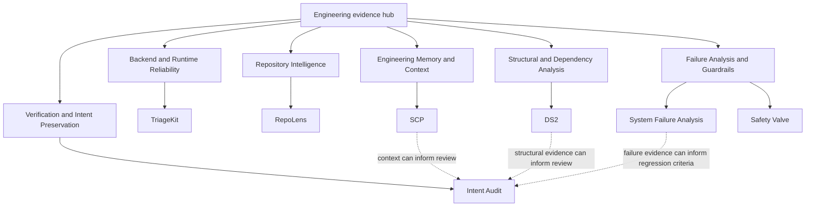

# Independent AI Systems & Software Reliability Engineering

Evidence hub for independent engineering work completed 2023–Present.

Sustained independent engineering work focused on reliable Python backends, deterministic verification, repository intelligence, software reliability, and reliable AI-assisted development practices.

**Primary positioning:** AI Systems & Software Reliability Engineer

**Additional fit:**

- Backend Software Engineer — Python, FastAPI, reliability engineering
- Developer Tooling / Repository Intelligence Engineer

These are positioning statements, not employment claims.

This repository organizes public engineering evidence from independent work completed from 2023–Present. Claims are supported by linked code, tests, architecture documentation, artifacts, documented benchmarks, and commit history. No employer, customer, production traffic, commercial deployment, enterprise adoption, submitted pull request, or merged contribution is claimed.

## Engineering Focus

- Backend Software Engineering
- AI Systems Engineering
- Software Reliability
- Deterministic Verification
- Repository Intelligence
- Root-Cause Analysis
- Developer Tooling
- Reliable AI-Assisted Development

## Reviewer Paths

### Recruiter or hiring manager — approximately 5 minutes

Read this page and the [Capability-to-Evidence Matrix](#capability-to-evidence-matrix), then review [TriageKit](https://github.com/ragnarok268/TriageKit), [Intent Audit](https://github.com/ragnarok268/IA), and the [Hiring Review Guide](HIRING_REVIEW_GUIDE.md).

### Backend or Python reviewer — approximately 15 minutes

Review [TriageKit](https://github.com/ragnarok268/TriageKit), [RepoLens](https://github.com/ragnarok268/RepoLens), [DS2](https://github.com/ragnarok268/DS2), and [SCP](https://github.com/ragnarok268/scp). Follow the evidence links below for tests, CI, migrations, authentication, persistence, logging, retry behavior, health checks, and deterministic outputs.

### AI systems or reliability reviewer — approximately 15 minutes

Review [Intent Audit](https://github.com/ragnarok268/IA), [TriageKit](https://github.com/ragnarok268/TriageKit), [System Failure Analysis](https://github.com/ragnarok268/system-failure-analysis), [Safety Valve](https://github.com/ragnarok268/safety-valve), and [SCP](https://github.com/ragnarok268/scp), then read [Architecture](ARCHITECTURE.md) and [Engineering Principles](ENGINEERING_PRINCIPLES.md).

### Developer tooling reviewer — approximately 15 minutes

Review [RepoLens](https://github.com/ragnarok268/RepoLens), [DS2](https://github.com/ragnarok268/DS2), [SCP](https://github.com/ragnarok268/scp), and [Intent Audit](https://github.com/ragnarok268/IA).

### Full technical review — 30 minutes or more

Read [Architecture](ARCHITECTURE.md), [Engineering Principles](ENGINEERING_PRINCIPLES.md), [AI-Assisted Engineering Workflow](AI_NATIVE_WORKFLOW.md), [Benchmarks](BENCHMARKS.md), and [Limitations](LIMITATIONS.md); then inspect linked repositories, tests, implementation files, and artifacts. [Start Here](START_HERE.md) provides the complete guided path.

## Capability-to-Evidence Matrix

| Capability | Evidence Repository | Specific Implementation | Verification Evidence | Relevant Roles |
| --- | --- | --- | --- | --- |
| Reliable Python backend engineering | [TriageKit](https://github.com/ragnarok268/TriageKit) | FastAPI; JWT auth; SQLAlchemy; Alembic; JSON logging and request IDs; bounded retries; health endpoints; Docker Compose | [Tests](https://github.com/ragnarok268/TriageKit/tree/main/tests), [CI](https://github.com/ragnarok268/TriageKit/blob/main/.github/workflows/ci.yml), [migration](https://github.com/ragnarok268/TriageKit/blob/main/app/db/migrations/versions/0001_initial.py), [retry tests](https://github.com/ragnarok268/TriageKit/blob/main/tests/test_provider_retries.py) | Backend Software Engineer; Python Backend Engineer; AI Backend Engineer; Software Reliability Engineer |
| Deterministic verification and drift detection | [Intent Audit](https://github.com/ragnarok268/IA) (repository `IA`) | `intent.yaml` contract; constraint detectors; deterministic Markdown/JSON receipts; Canary evidence, classification, bounded hypotheses, repair and regression guidance | [Scanner tests](https://github.com/ragnarok268/IA/blob/main/tests/test_scanner.py), [Canary tests](https://github.com/ragnarok268/IA/blob/main/tests/test_canary.py), [receipt fixture](https://github.com/ragnarok268/IA/blob/main/tests/fixtures/canary_fail_receipt.json) | AI Systems Engineer; AI Reliability Engineer; AI Governance Engineer; Developer Tooling Engineer |
| Repository intelligence and grounded analysis | [RepoLens](https://github.com/ragnarok268/RepoLens) | Deterministic scanning and chunking; Chroma persistence; offline hash embeddings; file-and-line citations; evidence-bound answers; architecture summaries | [Tests](https://github.com/ragnarok268/RepoLens/tree/main/tests), [design](https://github.com/ragnarok268/RepoLens/blob/main/docs/DESIGN.md), [sample](https://github.com/ragnarok268/RepoLens/blob/main/examples/sample_output.md) | Developer Tooling Engineer; Repository Intelligence Engineer; Backend Engineer; AI Systems Engineer |
| Persistent engineering context and repository boundaries | [SCP](https://github.com/ragnarok268/scp) | Adoption-forward YAML decisions; deterministic Canon validation; origin metadata; Git-root, remote, and nested-repository preflight | [Tests](https://github.com/ragnarok268/scp/tree/master/tests), [CI](https://github.com/ragnarok268/scp/blob/master/.github/workflows/ci.yml), [example](https://github.com/ragnarok268/scp/blob/master/examples/scp/SCP-0007.yaml) | Developer Tooling Engineer; AI Platform Engineer; Backend Engineer |
| Dependency and structural analysis | [DS2](https://github.com/ragnarok268/DS2) | Dependency and import mapping; exposure classification; inherited-authority analysis; deterministic reports, graphs, and receipts | [Tests](https://github.com/ragnarok268/DS2/tree/main/tests), [CI](https://github.com/ragnarok268/DS2/blob/main/.github/workflows/ci.yml), [receipt](https://github.com/ragnarok268/DS2/blob/main/artifacts/demo/ds2_receipt.json) | Developer Tooling Engineer; Backend Engineer; Backend / Platform Engineer; AI Platform Engineer |
| Deterministic workflow guardrails | [Safety Valve](https://github.com/ragnarok268/safety-valve) | Local CPU-only pre-inference gate; deterministic `ALLOW`, `BLOCK`, or `SANDBOX`; governance receipts; fail-closed review lane | [Tests](https://github.com/ragnarok268/safety-valve/blob/main/tests/test_pipeline_smoke.py), [examples](https://github.com/ragnarok268/safety-valve/tree/main/examples) | AI Reliability Engineer; AI Governance Engineer; AI Systems Engineer |
| Root-cause investigation and regression reasoning | [System Failure Analysis](https://github.com/ragnarok268/system-failure-analysis) | Five case studies covering state, persistence, dependency, coordination, and external-truth failures; evidence separated from reconstruction and missing verification | [Case index](https://github.com/ragnarok268/system-failure-analysis/blob/main/system-failure-analysis/job_artifact/CASE_INDEX.md), [status](https://github.com/ragnarok268/system-failure-analysis/blob/main/system-failure-analysis/job_artifact/ARTIFACT_VERIFICATION_STATUS.md), [audit](https://github.com/ragnarok268/system-failure-analysis/blob/main/system-failure-analysis/job_artifact/AUDIT_REPORT.md) | Software Reliability Engineer; Backend Engineer; AI Systems Engineer; Developer Tooling Engineer |

## Key Implementations

### 1. TriageKit — reliable Python backend engineering

Turns unstructured engineering intake into persisted, validated records without hiding provider failures. The FastAPI service implements JWT registration/login, SQLAlchemy persistence, Alembic migration, pluggable providers, structured logging, request IDs, reliability metadata, bounded retries for specified transient failures and timeouts, and health checks. Offline tests cover [authentication](https://github.com/ragnarok268/TriageKit/blob/main/tests/test_auth.py), [cases](https://github.com/ragnarok268/TriageKit/blob/main/tests/test_cases.py), [health](https://github.com/ragnarok268/TriageKit/blob/main/tests/test_health.py), [failures](https://github.com/ragnarok268/TriageKit/blob/main/tests/test_provider_failures.py), and [retries](https://github.com/ragnarok268/TriageKit/blob/main/tests/test_provider_retries.py). See its [architecture](https://github.com/ragnarok268/TriageKit/blob/main/docs/ARCHITECTURE.md).

### 2. Intent Audit (repository `IA`) — deterministic intent verification

Compares generated changes with explicit constraints. The local-first CLI evaluates a small `intent.yaml` contract and writes inspectable Markdown and JSON receipts. Canary is the diagnostic path after failed verification: it collects evidence, classifies failure, and produces bounded hypotheses, repair recommendations, and regression guidance. Evidence includes [scanner tests](https://github.com/ragnarok268/IA/blob/main/tests/test_scanner.py), [Canary tests](https://github.com/ragnarok268/IA/blob/main/tests/test_canary.py), fixtures, smoke scripts, and [documentation](https://github.com/ragnarok268/IA/blob/main/docs/CANARY.md).

### 3. RepoLens — grounded repository intelligence

Answers codebase questions from traceable local source. The CLI scans and deterministically chunks files, creates hash-based or locally cached semantic embeddings, persists vectors with Chroma, returns file-and-line citations, and generates an architecture map. Tests cover [scanning](https://github.com/ragnarok268/RepoLens/blob/main/tests/test_scanner.py), [chunking](https://github.com/ragnarok268/RepoLens/blob/main/tests/test_chunker.py), [citations](https://github.com/ragnarok268/RepoLens/blob/main/tests/test_citations.py), and [retrieval](https://github.com/ragnarok268/RepoLens/blob/main/tests/test_retrieval.py). See the [sample output](https://github.com/ragnarok268/RepoLens/blob/main/examples/sample_output.md).

### 4. System Failure Analysis — evidence-bounded investigation

Separates confirmed evidence, inferred mechanisms, proposed fixes, and executed verification. Five cases cover session and external-payment truth, asynchronous state races, dependency-range drift, credential-state coordination, and streaming-state mutation. Per-case manifests, root-cause documents, patch deltas, verification notes, an [artifact status matrix](https://github.com/ragnarok268/system-failure-analysis/blob/main/system-failure-analysis/job_artifact/ARTIFACT_VERIFICATION_STATUS.md), and a [validation receipt](https://github.com/ragnarok268/system-failure-analysis/blob/main/system-failure-analysis/job_artifact/receipts/validation_report.json) expose evidence and gaps. No upstream submission, maintainer review, or merge is claimed.

### 5. SCP — persistent context and boundary safety

Preserves constraints, rejected options, and revisit conditions. SCP stores adoption-forward decisions in a project-local YAML Canon, validates invariants, and checks Git root, expected remote, and nested unrelated repositories before work. CI and tests cover Canon behavior, CLI workflows, identity, and preflight checks. See its [schema](https://github.com/ragnarok268/scp/blob/master/docs/SCP_SCHEMA.md) and [boundary documentation](https://github.com/ragnarok268/scp/blob/master/docs/REPOSITORY_BOUNDARIES.md).

### 6. DS2 — dependency and authority-surface analysis

Maps authority introduced by dependencies and observed imports. DS2 classifies network, process, browser, database, cache, and cloud-adjacent exposure, then emits deterministic reports, graphs, and stable-hash receipts. It does not claim runtime reachability, CVE scanning, or complete SBOM coverage. Tests cover collection, import scanning, classification, golden outputs, CLI behavior, and determinism. See the [demo](https://github.com/ragnarok268/DS2/blob/main/artifacts/demo/DS2_REPORT.md) and [limitations](https://github.com/ragnarok268/DS2/blob/main/LIMITATIONS.md).

### 7. Safety Valve — deterministic pre-inference guardrails

Produces an inspectable decision before model inference or tool execution. This small local reference artifact maps input deterministically to `ALLOW`, `BLOCK`, or fail-closed `SANDBOX`, with a structured receipt. Public rules are intentionally limited; semantic policy coverage and tool execution are non-goals. [Tests](https://github.com/ragnarok268/safety-valve/blob/main/tests/test_pipeline_smoke.py) assert routing and receipt invariants.

## Engineering Method

```text
Problem definition
→ Requirements and constraints
→ Architecture
→ Implementation
→ Verification
→ Evidence
→ Regression protection
```

Define expected behavior first; identify constraints and invariants; design where appropriate; validate deterministically where practical; verify against explicit intent; protect fixes with regression tests; preserve evidence; and document assumptions, boundaries, and limitations.

See [Engineering Principles](ENGINEERING_PRINCIPLES.md).

## AI-Assisted Implementation

AI coding tools accelerate implementation. Architecture, requirements, constraints, code review, testing, verification, and final responsibility remain human-directed. Generated output is inspected and validated against explicit requirements before acceptance.

See [AI-Assisted Engineering Workflow](AI_NATIVE_WORKFLOW.md).

## Open-Source Investigation and Contribution Preparation

[System Failure Analysis](https://github.com/ragnarok268/system-failure-analysis) documents reported defects, recovered evidence, root-cause reasoning, narrow fix patterns, missing verification, and regression-test proposals. These artifacts support future contribution preparation; they do not establish upstream submission or acceptance.

**No external pull requests have been submitted yet.**

## Known Boundaries

- Independent and open-source work.
- No production traffic or production-scale operation claimed.
- No customers, revenue, enterprise adoption, or commercial deployment claimed.
- Production-oriented practices described only where code and evidence support them.
- Repository maturity and verification depth vary.
- Benchmark claims appear only where documented.
- No external pull requests have been submitted yet.

See [Limitations](LIMITATIONS.md).

## Architecture

The repositories provide evidence for related capabilities. These are conceptual review relationships, not a claim that every repository participates in one integrated runtime.



Mermaid source: [assets/architecture.mmd](assets/architecture.mmd). See [Architecture](ARCHITECTURE.md).

## Repository Navigation

- [Start Here](START_HERE.md)
- [Engineering Evidence Summary](PORTFOLIO_SUMMARY.md)
- [Hiring Review Guide](HIRING_REVIEW_GUIDE.md)
- [Architecture](ARCHITECTURE.md)
- [Capability and Repository Map](PROJECT_MAP.md)
- [AI-Assisted Engineering Workflow](AI_NATIVE_WORKFLOW.md)
- [Engineering Principles](ENGINEERING_PRINCIPLES.md)
- [Benchmarks](BENCHMARKS.md)
- [Limitations](LIMITATIONS.md)
- [Roadmap](ROADMAP.md)
